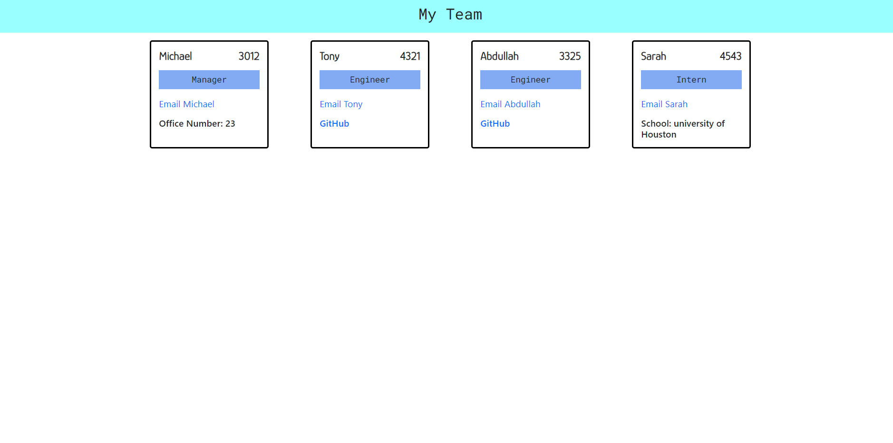

# work_place

## User Story
AS A manager I WANT to generate a webpage that displays my team's basic info
SO THAT I have quick access to their emails and GitHub profiles

## Bulid with
<ul>
<li>JavaScript</li>
<li>Node.js</li>
<li>HTML</li>
<li>CSS</li>
</ul>

## Screenshot
;